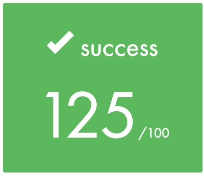

# 42 Cursus Project: Born2beRoot

## Introduction

This project aims to introduce you to the wonderful world of virtualization. You will create your first machine in VirtualBox under specific instructions. Then, at the end of this project, you will be able to set up your own operating system while implementing strict rules.

## Table of Contents

- [Born2beRoot PDF](./Born2beRoot.pdf)
- [Born2beRoot with Debian OS](./guides/born2beroot_debian.md)
- [Evaluation Process](./guides/Evaluation_Process.pdf)
- [Evaluation Answers](./guides/evaluation_process_answers.md)
- [Commands Guides](./guides/commands.md)
- [Monitoring Script](./scripts/monitoring.sh)
- [References](./guides/references.md)

## Score

- 29 Black Hole days added
- 125/100 (Included Bonus)  
  

## Acknowledgements

I would like to thank [@gkintana](https://github.com/gkintana) for providing the evaluation process guide. Also with the help of [@aziz](https://github.com/bread-thumbs-up/aikram42), we were able to perfect the partitioning for bonus part.

## Author

- Website - [Fidel Lim](https://fidellim-portfolio.netlify.app/)
- Github - [@fidellim](https://github.com/fidellim)
