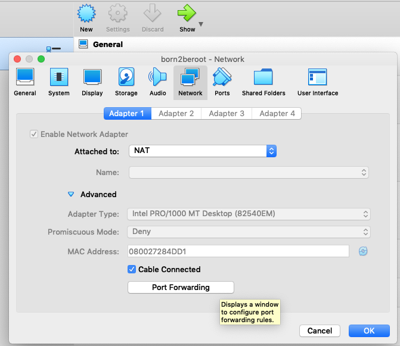
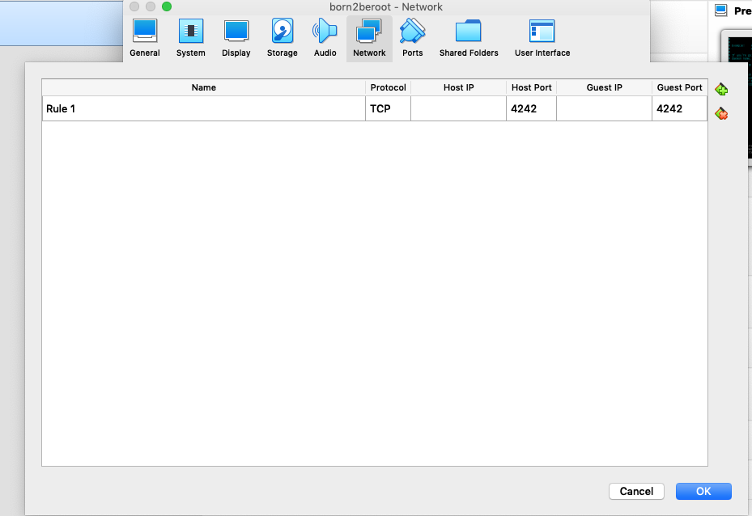
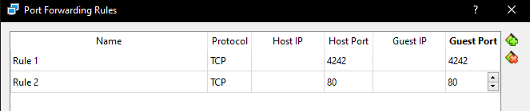
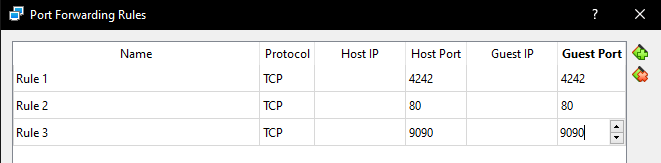

# Born2beRoot with Debian OS

## Debian Installation

- Download VirtualBox virtual machine [here](https://www.virtualbox.org/)
- Download Debian OS [here](https://www.debian.org/)
- Watch partition (bonus) set-up [here](https://youtu.be/OQEdjt38ZJA)

## Partition Information

### Mandatory

- sda (Hard Drive Space) : 8 GB
  - sda1 [/boot] : 487 MB
  - sda5_crypt : max
    - wil--vg-root [/] : 2.8 GB
    - wil--vg-swap [SWAP] : 976 MB
    - wil--vg-home [/home] : 3.8 GB

### Bonus

- sda (Hard Drive Space) : 31540 MB
  - sda1 [/boot] : 524.934 MB
  - sda5_crypt : max
    - LVMGroup-root [/] : 10.732 GB
    - LVMGroup-swap [SWAP] : 2.464 GB
    - LVMGroup-home [/home] : 5.339 GB
    - LVMGroup-var [/var] : 3.189 GB
    - LVMGroup-srv [/srv] : 3.189 GB
    - LVMGroup-tmp [/tmp] : 3.189 GB
    - LVMGroup-var--log [/var/log] : 4345.366 MB

## Sudo

### Step 1: Install sudo

Change user to root account, simply run `su` or `su –` without any arguments.

```sh
$ su
Password: (characters will not be shown here)
```

Install sudo using `apt install sudo`.

```sh
$ apt install sudo
```

To verify if sudo is installed successfully, run `dpkg -l | grep sudo` or `sudo`

```sh
$ dpkg -l | grep sudo
```

```sh
$ sudo
# if sudo is installed, it will display a short help message
# if not, it will display a message "sudo command not found"
```

### Step 2: Adding User to sudo Group

Add user to sudo group by running either of the commands: `adduser <username> sudo` or `usermod -aG sudo <username>`

```sh
$ sudo adduser <username> sudo
```

```sh
$ usermod -aG sudo <username>
```

To verify if user has been added to sudo, check the following commands below:

```sh
$ groups <username>
<username> : <username> cdrom floppy sudo audio dip video plugdev netdev bluetooth
$ getent group sudo
sudo:x:27:<username>
$ id -Gn <username>
<username> cdrom floppy sudo audio dip video plugdev netdev bluetooth
```

To make changes take effect, run `reboot` and login using your user.

```sh
$ reboot
<--->
Debian GNU/Linux 10 <hostname> tty1

<hostname> login: <username>
Password: <password>
<--->
```

To verify sudopowers of user, check the following commands below:

```sh
# It is usually used to extend your sudo password timeout, but can be used for
# determining whether you have any sudo privileges. It won't show any message if user
# has sudopowers.
$ sudo -v
[sudo] password for <username>: <password>
Sorry, user [username] may not run sudo on [hostname].
```

```sh
# It will list any sudo privileges you have.
$ sudo -l
[sudo] password for <username>: <password>
```

### Step 3: Running root-Privileged Commands

Run root-privileged commands via prefix `sudo`. For instance:

```sh
$ sudo apt install vim
# Vim (Vi IMproved) is a text editor. It is an improved version of vi.
$ sudo apt update
# update installed packages
```

### Step 4: Configure sudo Group

Create directory `/var/log/sudo`. This is where the log file will be saved.

```sh
$ sudo mkdir /var/log/sudo
```

Configure sudo in this path `/etc/sudoers.d/<filename>`. `<filename>` shall not end in `~` or contain `.`.

```sh
$ sudo vim /etc/sudoers.d/sudo_config

# Why use /etc/sudoers.d/ ?

# - Typically /etc/sudoers is under control of your distribution\'s package manager.
# If you have made changes to that file and the package manager wants to upgrade it,
# you will have to manually inspect the changes and approve how they are merged into
# the new version. By placing your local changes into a file in the /etc/sudoers.d/
# directory, you avoid this manual step and upgrades can proceed automatically.
```

Edit the file `/etc/sudoers.d/<filename>`. Then, configure the new sudo rules. Just to make sure, right after `Defaults` there is a tab space.

```sh
# Limit authentication using sudo to 3 attempts (defaults to 3 anyway) in the event of an incorrect password
Defaults        passwd_tries=3

# Add a custom error message in the event of an incorrect password
Defaults        badpass_message="Sorry, wrong password! Try again!"

# Log all sudo commands to /var/log/sudo/<filename>
Defaults        logfile="/var/log/sudo/sudo.log"

# To archive all sudo inputs & outputs to /var/log/sudo/:
# The default I/O log directory is /var/log/sudo-io
Defaults        log_input,log_output
Defaults        iolog_dir="/var/log/sudo"

# To require TTY:
# Why use tty? If some non-root code is exploited (a PHP script, for example), the requiretty option means that the exploit code won't be able to directly upgrade its privileges by running sudo.)
Defaults        requiretty

# Define secure paths
Defaults        secure_path="/usr/local/sbin:/usr/local/bin:/usr/sbin:/usr/bin:/sbin:/bin:/snap/bin"
```

## SSH & UFW

### Step 1: Install & Configure SSH

Install openssh-server

```sh
$ sudo apt install openssh-server
```

Verify if openssh-server is installed

```
$ ssh -V
```

```
$ dpkg -l | grep ssh
```

Configure SSH in `/etc/ssh/sshd_config`

```
$ sudo vim /etc/ssh/sshd_config
```

Find and change the following lines in `/etc/ssh/sshd_config`

```
# Set-up SSH using Port 4242
#Port22 -> Port 4242

# Disable SSH login as root
#PermitRootLogin prohibit-password -> PermitRootLogin no
```

Check status of SSH

```sh
$ sudo service ssh status
```

```sh
$ sudo systemctl status ssh
```

### Step 2: Install & Configure UFW (Uncomplicated Firewall)

Install UFW

```sh
$ sudo apt install ufw
```

Verify if UFW is installed

```sh
$ dpkg -l | grep ufw
```

Enable UFW (firewall)

```sh
$ sudo ufw enable
```

Allow incoming connections using `Port 4242`

```sh
$ sudo ufw allow 4242
```

Check UFW status

```sh
$ sudo ufw status
```

### Step 3: Connecting to Server via SSH

SSH into your virtual machine using `Port 4242`. To check IP address, use command `ip addr show` or `ip a`

```sh
$ ssh <username>@<ip_address> -p 4242
```

Alternatively, you can add a forward rule on your machine

```
1. Go to VirtualBox -> Choose the VM-> Select Settings
2. Choose “Network” -> "Adapter 1" -> "Advanced" -> "Port Forwarding"
```

<br/>



Enter the values shown:
<br/>



Restart SSH server

```sh
$ sudo systemctl restart ssh
```

Check SSH status

```sh
$ sudo service sshd status
```

From host side from iTerm2 or Terminal enter as shown below:

```sh
$ ssh <username>@127.0.0.1 -p 4242
```

To leave SSH connection use either of the following commands below:

```
$ logout
```

```
$ exit
```

## User Management

### Step 1: Set Up a Strong Password Policy

#### Password Age

Configure password age policy using the command: `sudo vim /etc/login.defs`

```sh
# Set password to expire every 30 days
| line 160 | PASS_MAX_DAYS  99999 -> PASS_MAX_DAYS  30

# Set minimum number of days allowed before modification of password to 2 days
| line 161 | PASS_MIN_DAYS  0 -> PASS_MIN_DAYS  2

# Send warning message to user 7 days before password expires (default is 7 days)
| line 161 | PASS_WARN_AGE  7
```

#### Password Strength

Install package `libpam-pwquality` to set up password strength policies

```sh
$ sudo apt install libpam-pwquality
```

Verify if `libpam-pwquality` package has been installed successfully

```
$ dpkg -l | grep libpam-pwquality
```

Configure password strength policy by going to file `sudo vim /etc/pam.d/common-password`.

```sh
25 password        requisite                       pam_pwquality.so retry=3 <add policies here>
```

Output should look like this:

```
25 password        requisite                       pam_pwquality.so retry=3 minlen=10 ucredit=-1 dcredit=-1 maxrepeat=3 reject_username difok=7 enforce_for_root
```

Explanation of password policies

```sh
# Set password minimum length to 10 characters
minlen=10

# Require at least an uppercase and numeric character
# -1 means that it requires at least one character
ucredit=-1
dcredit=-1

# Set a maximum of 3 consecutive identical characters
maxrepeat=3

# Reject password if it contains name of user
reject_username

# Set the number of changes required in the new password from old password to 7
difok=7

# Implement the same policy on root
enforce_for_root
```

Set new passwords for the users already created (root included), following the new password policy:

```
$ passwd      <- change user password
$ sudo passwd <- change root password
```

New Passwords

**flim** : `42AbuDhabi123!`

**root** : `42AbuDhabi123!`

### Step 2: Creating New User

Create new user

```sh
$ sudo adduser <username>
```

Verify if user has been created

```sh
getent passwd <username>
```

Check user's password expiry information

```sh
$ sudo chage -l <username>
```

### Step 3: Creating New Group

Create new `user42` group

```sh
$ sudo addgroup user42
```

Add user to `user42` group by using either of the following commands:

```sh
$ sudo adduser <username> user42
```

```sh
$ sudo usermod -aG user42 <username>
```

Verify if user has been added to `user42`

```sh
$ getent group user42
```

## cron

Install netstat tools (for checking TCP connections which will be used in monitoring.sh)

```sh
$ sudo apt install net-tools
```

Change user to root account via `su` command.

```sh
$ su
```

Then, insert bash commands via `sudo vim /usr/local/bin/monitoring.sh`

The content of the `monitoring.sh` can be seen [here](../scripts/monitoring.sh)

Make the file executable

```sh
$ sudo chmod 755 /usr/local/bin/monitoring.sh
```

After adding content to `monitoring.sh`, you can go back to your `username` account via `su <username>`. Then, test the script by executing it

```sh
$ sh /usr/local/bin/monitoring.sh
```

If you would like to increase CPU load run the command:

```sh
$ for i in $(seq $(getconf _NPROCESSORS_ONLN)); do yes > /dev/null & done
```

To stop the program above, run the command:

```sh
$ pkill --signal STOP yes
```

Configure cron as root

```sh
$ sudo crontab -u root -e
```

Schedule a shell script to run every 10 minutes

```sh
# line 23
# m h  dom mon dow   command
*/10 * * * * sh /usr/local/bin/monitoring.sh | wall
```

Check root's scheduled cron jobs

```sh
$ sudo crontab -u root -l
```

## Bonus

### Install Wordpress with Lighttpd, MariaDB, PHP

#### Step 1: Install Lighttpd

Install lighttpd

```sh
$ sudo apt install lighttpd
```

Verify if lighttpd was installed

```sh
$ dpkg -l | grep lighttpd
```

Allow incoming connections using Port 80

```sh
$ sudo ufw allow 80
```

Add a new port forwarding rule for `Port 80` <br/>


#### Step 2: Install & Configuring MariaDB

Install _mariadb-server_

```
$ sudo apt install mariadb-server
```

Verify whether _mariadb-server_ was successfully installed

```
$ dpkg -l | grep mariadb-server
```

Start interactive script to remove insecure default settings via `sudo mysql_secure_installation`.

```
$ sudo mysql_secure_installation

Enter current password for root (enter for none): #Just press Enter (do not confuse database root with system root)
Switch to unix-socket authentication [Y/n] n
Set root password? [Y/n] n
Remove anonymous users? [Y/n] Y
Disallow root login remotely? [Y/n] Y
Remove test database and access to it? [Y/n] Y
Reload privilege tables now? [Y/n] Y
```

Log in to the MariaDB console via `sudo mariadb`.

```
$ sudo mariadb
MariaDB [(none)]>
```

Create new database via `CREATE DATABASE <database-name>;`.

```
MariaDB [(none)]> CREATE DATABASE wordpress;
```

Create new database user and grant them full privileges on the newly-created database via `GRANT ALL ON <database-name>.* TO '<username>'@'localhost' IDENTIFIED BY '<password>' WITH GRANT OPTION;`.

```
MariaDB [(none)]> GRANT ALL ON wordpress.* TO 'flim'@'localhost' IDENTIFIED BY 'flimAD' WITH GRANT OPTION;
```

Flush the privileges

```
MariaDB [(none)]> FLUSH PRIVILEGES;
```

Exit the MariaDB shell via `exit`.

```
MariaDB [(none)]> exit
```

Verify whether database user was successfully created by logging in to the MariaDB console via `mariadb -u <username-2> -p`.

```
$ mariadb -u flim -p
Enter password: flimAD
MariaDB [(none)]>
```

Confirm whether database user has access to the database via `SHOW DATABASES;`.

```
MariaDB [(none)]> SHOW DATABASES;
+--------------------+
| Database           |
+--------------------+
| wordpress          |
| information_schema |
+--------------------+
```

Exit the MariaDB shell via `exit`.

```
MariaDB [(none)]> exit
```

#### Step 3: Install PHP

Install php-cgi & php-mysql

```sh
$ sudo apt install php-cgi php-mysql
```

Verify whether php-cgi & php-mysql was successfully installed

```sh
$ dpkg -l | grep php
```

#### Step 4: Download & Configure Wordpress

Install _wget_

```
$ sudo apt install wget
```

Download WordPress to `/var/www/html`

```
$ sudo wget http://wordpress.org/latest.tar.gz -P /var/www/html
```

Extract downloaded content (Wordpress tar file)

```
$ sudo tar -xzvf /var/www/html/latest.tar.gz
```

Remove tarball

```
$ sudo rm /var/www/html/latest.tar.gz
```

Copy content of `/var/www/html/wordpress` to `/var/www/html`

```
$ sudo cp -r /var/www/html/wordpress/* /var/www/html
```

Remove `/var/www/html/wordpress`

```
$ sudo rm -rf /var/www/html/wordpress
```

Create WordPress configuration file from its sample via `sudo cp /var/www/html/wp-config-sample.php /var/www/html/wp-config.php`.

```
$ sudo cp /var/www/html/wp-config-sample.php /var/www/html/wp-config.php
```

Configure WordPress to reference previously-created MariaDB database & user

```
$ sudo vi /var/www/html/wp-config.php
```

Replace the commands below:

```
***BEFORE***
23 define( 'DB_NAME', 'database_name_here' );^M
26 define( 'DB_USER', 'username_here' );^M
29 define( 'DB_PASSWORD', 'password_here' );^M

***AFTER***
23 define( 'DB_NAME', 'wordpress' );^M
26 define( 'DB_USER', 'flim' );^M
29 define( 'DB_PASSWORD', 'flimAD' );^M
```

Change Wordpress folders permissions

```sh
$ sudo chown -R www-data:www-data /var/www/html/
$ sudo chmod -R 755 /var/www/html/
```

#### Step 5: Configure Lighttpd

Execute the commands below

```
$ sudo lighty-enable-mod fastcgi
$ sudo lighty-enable-mod fastcgi-php
$ sudo service lighttpd force-reload
```

#### Step 6: Check PHP info (OPTIONAL)

Add code in `/var/www/html/php.php`

```php
<?php phpinfo(); ?>
```

To check PHP info, go to your browser and enter this link

```
localhost:80/php.php
```

#### Step 7: Open Wordpress

By this time, you will be able to open and configure Wordpress. Just go to your browser and enter this link

```sh
# Port-80 is used for HTTP connection by default.
# Either of the links should work
localhost:80 || localhost
```

### Cockpit (Free Choice Service)

Install cockpit

```sh
$ sudo apt install cockpit
```

Allow `port 9090` on firewall

```sh
$ sudo ufw allow 9090
```

Add a new port forwarding rule for `Port 9090` <br/>


Open cockpit on a browser using `localhost:9090`

```sh
localhost: 9090
```

## Create Signature.txt

1. Go to the path of your virtual machine
   - `Windows`: %HOMEDRIVE%%HOMEPATH%\VirtualBox VMs\
   - `Linux`: ~/VirtualBox VMs/
   - `MacM1`: ~/Library/Containers/com.utmapp.UTM/Data/Documents/
   - `MacOS`: ~/VirtualBox VMs
2. Run the command below to generate the signature
   - `Windows`: certUtil -hashfile centos_serv.vdi sha1
   - `Linux`: sha1sum centos_serv.vdi
   - `For Mac M1`: shasum Centos.utm/Images/disk-0.qcow2
   - `MacOS`: shasum centos_serv.vdi
   - **Example output**: 6e657c4619944be17df3c31faa030c25e43e40a
3. Copy the signature and paste it in a file called `signature.txt`
