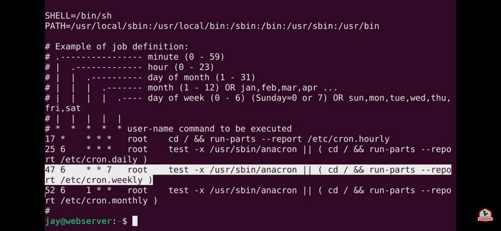

# Born2beRoot Commands

## SSH

Start OpenSSH

```sh
$ sudo /etc/init.d/ssh start
$ sudo service ssh start
$ sudo systemctl start ssh
```

Stop OpenSSH

```sh
$ sudo /etc/init.d/ssh stop
$ sudo service ssh stop
$ sudo systemctl stop ssh
```

Restart OpenSSH

```sh
$ sudo /etc/init.d/ssh restart
$ sudo service ssh restart
$ sudo systemctl restart ssh
```

Status of OpenSSH

```sh
$ sudo /etc/init.d/ssh status
$ sudo service ssh status
$ sudo systemctl status ssh
```

Enable and start OpenSSh at boot time

```sh
$ sudo systemctl enable ssh
```

Check if OpenSSH is enabled at boot time

```sh
$ sudo systemctl is-enabled ssh
```

## UFW

Display UFW rules

```
$ sudo ufw status numbered
$ sudo ufw status
```

Enable UFW

```
$ sudo ufw enable
$ sudo systemctl enable ufw
```

Disable UFW

```
$ sudo ufw disable
```

Add UFW rule

```
$ sudo ufw allow <port number>
```

Delete UFW rule

```
$ sudo ufw delete <rule number>
$ sudo ufw delete allow <port number>
```

## Hostname

Show current host information

```sh
$ sudo hostnamectl status
```

Change hostname

```sh
$ sudo hostnamectl set-hostname <new-hostname>
```

```sh
$ sudo vim /etc/hostname
```

Change `etc/hosts` file

```
$ sudo vim /etc/hosts
```

Change old_hostname to new_hostname

```
127.0.0.1   localhost
127.0.0.1   new_hostname
```

Reboot and check changes

```
$ sudo reboot
```

## User

- `less /etc/passwd | cut -d ":" -f 1` - show list of all users on computer;
- `users` - show list of all users who are currently logged in;
- `useradd <username>` - create new user with home directory;
- `usermod <username>` - modify users settings, `-l` for username, `-c` for comments/Full Name and `-g` for GID;
- `userdel -r <username>` - deletes user and all files attached to it;
- `id -u <username>` - shows user's UID.

## Group

- `less /etc/group | cut -d ":" -f 1` - show list of all users on computer;
- `groups <username>` - shows user's groups;
- `groupadd <groupname>` - create new group;
- `groupdel <groupname>` - delete group;
- `gpasswd -a <username> <groupname>` - adds user to group;
- `gpasswd -d <username> <groupname>` - removes user from group;
- `getent group <groupname>` - show users in group;
- `id -g <username>` - show user's main group GID.

## Cron


